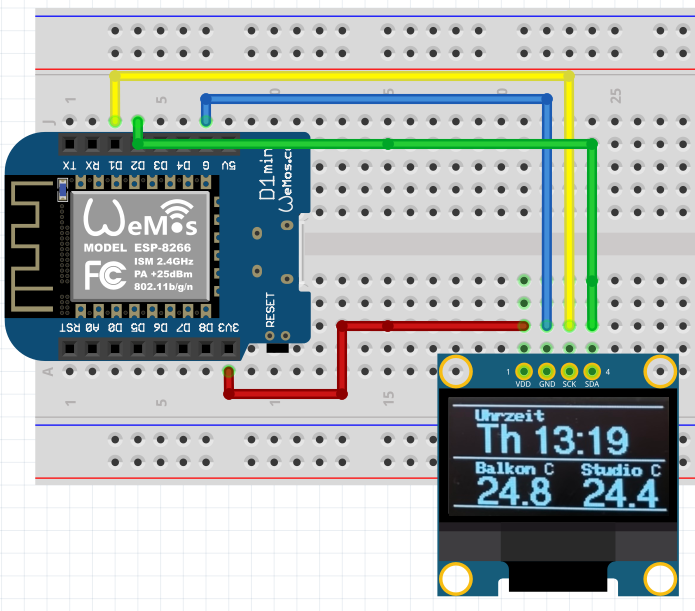

GFX_Panel mupplet
======================



The `mup_gfx_panel` mupplet displays sensor values as numbers or plots. Supported displays are:
* Oled SSD1306 128x64
* TFT ST7735 128x128, 128x160


The display is divded into slots of either 32x32 or 64x32 pixels. Each slot can either display
a short string, a number or a graphical plot. Data source for the values displayed are pub/sub
topics (either internal, or, if available, MQTT topics).

It can optionally read it's basic configuration from a JSON file on ESPs data partition.
The name of the json file is determined by the name of the instance of the mupplet:

## Example Oled

See [gfxPanel example](https://github.com/muwerk/mupplet-sensor/blob/master/examples/platformio_gfx_panel/src/gfxPanel.cpp) for the source.

```cpp
ustd::GfxPanel displayOled("display1", ustd::GfxDrivers::DisplayType::SSD1306, 128,64, 0x3c, &Wire);
```

This Display will look for a json file `display1.json`. A sample content could be:

```json
    "layout": "dg|G",
    "topics": ["sensor/data1", "sensor/data1", "sensor/data2"],
    "captions": ["Data 1 _N", "Data 1 _N", "(will be set dyn.)"],
```

- **`layout`** defines the slots that are available to display information. Each slot is described by a single letter, and `|` marks
  a new line. An upper-case letter defines a large 64x32 slot, lower-case is used for 32x32 slots.
  
  The example displays a `S` large 64x32 string in line 1, and two 32x32 `f` floats with one decimal in line. 
  
  ## Layout definitions
  
  Possible letter codes for the layout (e.g. `layout="dg|G"`) are:
  


  - `S`: simply display content of MQTT message as string.
  - `I`: display MQTT converted to integer.
  - `P`: display MQTT as int(value * 100.0)%. (percentage)
  - `F`: display as float with one decimal
  - `D`: with two decimals
  - `T`: with three decimals
  - `G`: show a graphical plot of the value history
   
- **`topics`** define a list of external MQTT topics (marked by leading '!') or internal message topics (no leading '!'). A special
  topic `clock/timeinfo` displays weekday and time. Since there are three display-slots (`d`, `g`, `G`), there are three topics.
- **`captions`** Each display-slot has a caption. Default font is bold. A `_` character can be used to switch between bold and normal.
  e.g. `Out _C` will print as **`Out`**` C`.
  
## TFT displays

Display instance:

```
//  pinout                                                                             CS  DC  RST
ustd::GfxPanel displayTft("display1", ustd::GfxDrivers::DisplayType::ST7735, 160, 128,  5, 16, 17);
```

Layout as code:
```
    const char *topics2[]={"sensor/data1", "sensor/data1", "sensor/data2","sensor/data3", "sensor/data3", "sensor/data4"};
    const char *captions2[]={"Data 1 _N", "Data 1 _N", "(will be set dyn.)","Data 3 _N", "Data 3 _N", "(will be set dyn.)"};
    displayTft.begin(&sched, "dg|G|dg|G", 6, topics2, captions2,true);
    displayTft.setSlotHistorySampleRateMs(1,500);  // set frame rate to 500ms for second slot (no. 1, zero based index)
    displayTft.setSlotHistorySampleRateMs(2,300);
    displayTft.setSlotHistorySampleRateMs(4,250);
    displayTft.setSlotHistorySampleRateMs(5,400);
```


